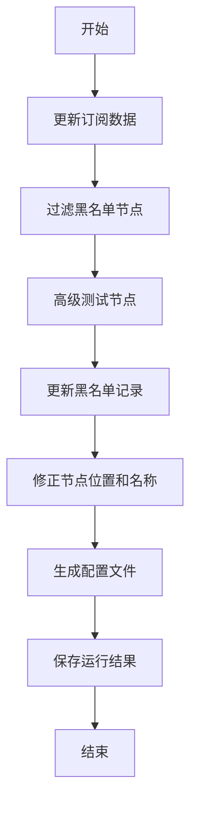
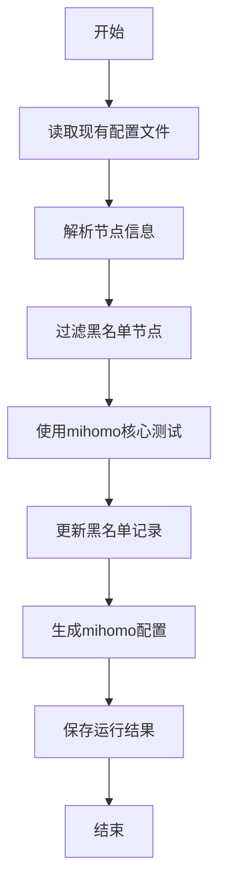

# 📋 本地运行功能配置说明

## 🎯 功能概述

本地运行管理器整合了项目现有功能，提供以下运行模式：

### 🔧 手动模式
1. **模式1: 更新订阅测试并重命名** - 完整的订阅更新、测试、重命名流程
2. **模式2: 从现有配置构建mihomo测试** - 基于现有配置文件进行mihomo测试

### 🤖 自动模式
- 根据配置定时执行上述两种模式
- 自动清理黑名单过期记录
- 支持灵活的cron表达式配置

### 🚫 黑名单功能
- 自动记录连续失败的节点
- 防止无效节点重复测试
- 支持手动管理和报告导出

## ⚙️ 配置文件 (config/custom.yaml)

在现有配置基础上添加以下配置段：

```yaml
# 现有配置保持不变...
subscriptions: []
outputs: []
testing: {}

# === 新增本地运行配置 ===

# 黑名单配置
blacklist:
  maxFailures: 3              # 连续失败多少次加入黑名单
  duration: 86400000          # 黑名单持续时间（毫秒），默认24小时
  autoCleanup: true           # 是否自动清理过期记录

# 本地运行配置
localRun:
  # 定时任务配置
  schedule:
    # 模式1: 更新订阅测试并重命名
    mode1:
      enabled: true
      cron: "0 */6 * * *"      # 每6小时执行一次
    
    # 模式2: 从现有配置构建mihomo测试  
    mode2:
      enabled: true
      cron: "0 */2 * * *"      # 每2小时执行一次
    
    # 黑名单清理
    cleanup:
      enabled: true
      cron: "0 2 * * *"        # 每天凌晨2点清理

# 测试配置扩展
testing:
  enabled: true
  coreType: "mihomo"          # 默认使用mihomo核心
  useCoreTest: true           # 启用核心测试
  fallbackToBasic: true       # 核心测试失败时回退到基本测试
  verifyLocation: true        # 启用位置验证
  timeout: 8000               # 超时时间
  concurrency: 10             # 并发数
  # ... 其他现有测试配置
```

## 🚀 使用方法

### 命令行界面 (推荐)

```bash
# 启动交互式本地运行管理器
npm run local:run
```

### 直接执行特定模式

```bash
# 执行模式1
npm run local:mode1

# 执行模式2  
npm run local:mode2

# 查看黑名单报告
npm run blacklist:report
```

### 程序化调用

```javascript
import { LocalRunManager } from './src/core/LocalRunManager.js';

const manager = new LocalRunManager();
await manager.initialize();

// 执行模式1
const result1 = await manager.runMode1UpdateAndTest();

// 执行模式2
const result2 = await manager.runMode2ConfigTest();

// 启动自动模式
await manager.startAutoMode();

// 查看状态
const status = manager.getStatus();
```

## 📊 运行流程详解

### 模式1: 更新订阅测试并重命名



**适用场景:**
- 定期更新和维护订阅
- 确保配置文件中节点的有效性
- 自动修正节点名称格式

### 模式2: 从现有配置构建mihomo测试



**适用场景:**
- 验证现有配置文件中节点的可用性
- 生成可直接使用的mihomo配置
- 快速测试和筛选可用节点

## 🚫 黑名单机制

### 工作原理

1. **失败记录**: 每次节点测试失败时记录失败次数和时间
2. **自动拉黑**: 连续失败达到阈值时自动加入黑名单
3. **过期恢复**: 黑名单有有效期，过期后自动恢复
4. **手动管理**: 支持手动添加、移除和重置

### 黑名单数据结构

```json
{
  "nodes": {
    "ss://example.com:443": {
      "name": "节点名称",
      "server": "example.com", 
      "port": 443,
      "type": "ss",
      "failures": 3,
      "lastFailure": 1640995200000,
      "blacklisted": true,
      "firstSeen": 1640908800000,
      "lastTested": 1640995200000,
      "lastError": "连接超时"
    }
  },
  "lastUpdated": 1640995200000
}
```

## 📈 监控和报告

### 运行状态查询

```bash
# 通过命令行界面查看
npm run local:run
# 选择: 8. 查看运行状态

# 或程序化查询
const status = manager.getStatus();
console.log(status);
```

### 黑名单报告

```bash
# 导出黑名单报告
npm run blacklist:report

# 或通过命令行界面
npm run local:run  
# 选择: 6. 导出黑名单报告
```

### 运行结果文件

运行结果会自动保存到以下位置：
- `config/last_run_result.json` - 最后一次运行结果
- `config/blacklist.json` - 黑名单数据
- `config/blacklist_report.json` - 黑名单报告 (手动导出)

## 🔧 高级配置

### 自定义测试参数

```yaml
testing:
  coreType: "v2ray"           # 使用v2ray核心
  timeout: 10000              # 增加超时时间
  concurrency: 5              # 减少并发数以降低负载
  useCoreTest: false          # 禁用核心测试，仅使用基本连接测试
```

### 自定义定时任务

```yaml
localRun:
  schedule:
    mode1:
      cron: "0 8,20 * * *"    # 每天上午8点和晚上8点执行
    mode2:
      cron: "*/30 * * * *"    # 每30分钟执行一次
```

### 黑名单策略调优

```yaml
blacklist:
  maxFailures: 5              # 更宽松的失败阈值
  duration: 172800000         # 48小时黑名单时间
  autoCleanup: false          # 禁用自动清理
```

## 🚨 注意事项

### 性能考虑
- 合理设置并发数量，避免过载
- 大量节点时建议适当增加超时时间
- 自动模式会持续占用资源，按需启用

### 安全考虑
- 黑名单文件包含节点信息，注意保护隐私
- 定时任务会在后台运行，确保系统稳定
- 建议定期备份配置和黑名单数据

### 兼容性
- 需要现有的订阅配置和输出配置正确设置
- 依赖项目现有的SyncManager和AdvancedNodeTester
- 与现有的schedule.js功能互补，可同时使用

## 🐛 故障排除

### 常见问题

1. **初始化失败**
   - 检查config/custom.yaml配置文件是否存在且格式正确
   - 确保必要的目录权限

2. **核心下载失败** 
   - 检查网络连接
   - 确保.cores目录有写入权限
   - 可以手动运行 `npm run test:nodes:mihomo` 测试

3. **黑名单不生效**
   - 检查config目录是否可写
   - 验证黑名单配置是否正确

4. **定时任务未执行**
   - 检查cron表达式格式
   - 确认自动模式已正确启动
   - 查看控制台输出和错误日志

### 调试模式

```bash
# 启用详细日志
DEBUG=* npm run local:run

# 单独测试各个组件
npm run test:nodes:mihomo   # 测试核心功能
npm run sync               # 测试订阅同步
``` 